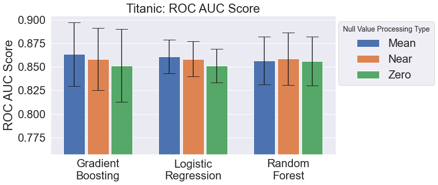

# Titanic
### A novel approach to a classic problem.

In this project I am working on Kaggle's Titanic dataset. I am using machine learning models to make predictions on the survival of Titanic passengers based upon features such as sex, age and ticket prices. First, I complete some initial data exploration using some typical Pandas tools to get a feel for, and a basic understanding of, the data. I later do more detailed feature engineering such as null value processing, one-hot encoding, and feature scaling. Once the data is processed into training and cross validation data and the models are loaded, the models make predictions which are compared against the true value survival data. The success of these predictions are given by three single valued metrics: accuracy, F1 score and ROC AUC score.

### Results

